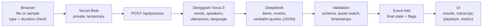

# Plan — recorded conversation → final commitments

Working plan. The brief is in [docs/TASK.md](docs/TASK.md); progress, time log and
decisions are in [PROGRESS.md](PROGRESS.md).

## 1. Goal

A browser app: the user uploads a short recording of a two-person project discussion and
gets back only what was actually agreed — tasks, owners, deadlines — plus the questions left
open. Every item carries a verbatim quote with a timestamp that the user can play.

The value of the product is reliability: it must not invent anything, and it must show why
each item is — or is not — a commitment.

## 2. Scope

**In scope**

- Input: an audio file up to 3 minutes — uploaded, or one of the bundled samples, which is
  processed live like any other file. English, two speakers who introduce themselves,
  no overlapping speech.
- Output: agreed tasks (owner, deadline, flags), unresolved questions, and excluded items with
  reasons (proposals never accepted, cancelled tasks). Each item has timestamped evidence
  with segment playback.
- Guardrails: file too long or unsupported, non-English or no speech, not two speakers,
  speakers never introduced, nothing agreed.
- Measurements: time per processing stage; variable cost per operation and per audio minute.
- A reproducible test set with expected results written before testing, plus an eval script.

**Out of scope:** calendar integration, sending tasks, accounts, payments, mobile apps,
more than two speakers, overlapping speech, recordings over 3 minutes, other languages,
editing results, storing run history.

**If time allows** (first to cut): microphone recording, copy as JSON/Markdown, resolving
weekday deadlines when the recording states its own date, model comparison, a holdout
recording with human voices.

## 3. Requirements traceability

| # | Requirement (from the brief) | Addressed by |
|---|---|---|
| R1 | Final agreed tasks, owners, deadlines, unresolved questions | Extraction + event fold (§4.2) |
| R2 | A timestamped supporting quotation for each item | Quote verification against ASR word timings (§4.1) |
| R3 | Users can listen to the supporting segment | Segment playback in the UI |
| R4 | Final state only; “could” ≠ “will”; cancelled ≠ active; no inferred owner/deadline | Fold rules, unit tests, exclusion checks in eval |
| R5 | Unresolvable relative dates keep their wording and are flagged | Deadline rules (§4.1, item 5) |
| R6 | Recording, independent expected list, second version with one changed agreement | Test set T1/T2 (§6) |
| R7 | An input that needs clarification or a refusal | T3 + guardrails (§6) |
| R8 | Inclusion and exclusion are both checked | Eval script (§6) |
| R9 | Processing time and cost per audio minute | Measurements (§7) |
| R10 | New input is really processed; no prepared answers | Samples use the same pipeline; nothing is cached per file |
| R11 | Browser demo, repo with setup, ≤ 3-minute video, delivery notes | Definition of done (§9) |

## 4. Architecture

**Why the upload goes through Blob.** Vercel Functions reject request bodies over 4.5 MB
(a 3-minute WAV is about 30 MB), and Deepgram's REST API does not accept requests from
browsers. So the browser uploads the file to a private Blob store. The server fetches it,
sends it to Deepgram and deletes the blob right after transcription. Playback in the UI uses
the local copy of the file in the browser.

### 4.1 Design principles

1. **Timestamps come only from ASR.** The LLM sees numbered utterances
   (`[U07] 0:42 Speaker B: …`) and returns utterance IDs with verbatim quotes. Code maps each
   quote to word timings.
2. **Code verifies every quote.** Each quote is checked as a normalised substring (case and
   punctuation ignored) of the utterances it references. A failed match invalidates that
   evidence. An item without valid evidence cannot be "agreed"; it is flagged for review.
3. **The LLM reports a history; code decides the final state.** For each item the model lists
   events with quotes: proposed, accepted, assigned, deadline set/changed, cancelled, and so on.
   A deterministic, unit-tested fold turns them into the final status, owner and deadline.
4. **Owners are speaker labels.** Names are resolved separately from self-introductions, with
   evidence. The user can fix a wrong mapping in the UI without re-running the model.
5. **Relative dates stay as spoken.** The model never receives today's date. Code strips any
   concrete date that has no anchor quote from the recording. Expressions that cannot be
   resolved ("by Friday", "before launch", "next Friday") are flagged "date not stated in the
   recording".
6. **Three result blocks:**
   - ✅ Agreed tasks.
   - ❓ Unresolved: open questions and items that need confirmation.
   - 🚫 Not commitments (collapsed): proposals never accepted and cancelled tasks, each with a
     reason and a quote.
7. **Honest refusals instead of forced output** (see the guardrails in §2).

### 4.2 Fold rules (unit-tested)

- A task is **agreed** if it has an explicit acceptance or self-commitment and no later
  cancellation, unless it was reinstated after that cancellation.
- Only a tentative acceptance ("I'll try", "maybe") → **needs confirmation**.
- A proposal with no acceptance, or a declined one → **not agreed**.
- Accepted, then cancelled → **cancelled**.
- **Owner** = the latest assignment or self-assignment backed by evidence; otherwise
  "no owner agreed".
- **Deadline** = the latest deadline event backed by evidence. Earlier values stay in the
  history ("corrected from Friday").
- A **question** is unresolved if it was raised and never answered.

## 5. Stack

| Layer | Choice | Rejected (why) |
|---|---|---|
| Language | TypeScript everywhere | Python: separate hosting, less UI control. Flutter Web: two languages, heavy first load |
| App | Next.js (App Router) + React | Vite SPA + separate backend: two deployments |
| UI | Tailwind CSS + shadcn/ui | — |
| Hosting | Vercel (Hobby) + Vercel Blob | Render: free tier sleeps. Railway / Fly.io: paid from day one. Firebase: paid plan required |
| ASR | Deepgram Nova-3, pre-recorded, `diarize_model=v2` | AssemblyAI: async polling. OpenAI diarize model: segment-level timestamps only. Multimodal LLM: imprecise timestamps |
| LLM | DeepSeek: `deepseek-flash` by default; `deepseek-v4-pro` and thinking mode compared in eval | Claude Opus 5: strongest candidate (schema-guaranteed output), dropped because of the budget |
| LLM client | `fetch` to DeepSeek's OpenAI-compatible endpoint, behind a thin adapter, response validated with Zod | `openai` npm package: `thinking`, `reasoning_effort: "max"` and the cache fields in `usage` are not in its types |
| Validation | Zod | — |
| Tests | Vitest + eval script | — |
| Test audio | Deepgram Aura-2 TTS | ElevenLabs: extra account, free-tier licence limits. macOS `say`: licence forbids public sharing. Kokoro: longer setup |

**Budget constraint: no out-of-pocket spend.** Deepgram's $200 starter credit (no card
needed), the existing DeepSeek balance and the Vercel Hobby limits cover development and the
demo. The cost report still uses list prices.

**DeepSeek trade-offs and mitigations**

- **JSON without schema guarantee.** JSON mode (`response_format: {type: "json_object"}`)
  guarantees valid JSON but not our schema, and the docs warn it "may occasionally return empty
  content". Mitigation: Zod validation plus one retry that feeds back the validation error.
  Retries are counted in time and cost.
- **Thinking mode compatibility.** The docs do not say whether JSON mode works with thinking
  mode (`thinking: {type: "enabled"}`). A spike on 2026-09-17 confirmed that it does.
- **Data location.** DeepSeek's privacy policy says personal data is stored in the PRC and may
  be used for model training (with an opt-out). This is acceptable for fictional test data. For
  real client recordings, the thin adapter lets us swap providers; this goes into the delivery
  notes.
- **Peak / off-peak pricing.** The cost calculator applies the rate for the time of the request,
  and the report also states the peak (worst-case) rate.

## 6. Test set and evaluation

Fixtures live in `fixtures/<id>/`: `script.json` (the dialogue), the generated audio, and
`expected.json` (written by hand).

- **T1 — normal.** About 1.5–2 minutes; both speakers introduce themselves. Contains:
  - a proposal that is never accepted;
  - an accepted task;
  - a corrected deadline;
  - a cancelled task;
  - a task with no named owner;
  - an unresolved question;
  - relative deadlines without date context.
- **T2 — one changed agreement.** The same script with exactly one line changed: the
  cancellation becomes a confirmation, so that task moves from "cancelled" to "agreed".
- **T3 — clarify or decline.** The speakers never introduce themselves and only talk in hedges.
  It runs about 45 seconds: a 22-second draft was too short for diarization to separate the
  two voices. Expected:
  - the app asks who the speakers are;
  - zero agreed tasks;
  - the items are marked as needing confirmation.
- **Guardrails.** A file over 3 minutes is rejected before any API call. A short non-English
  clip is rejected after transcription, without an LLM call.
- **Holdout (optional).** A different conversation, run only after the prompt is frozen;
  ideally with human voices.

**Order of work.** Scripts and `expected.json` are derived from the brief, never from the
app's output, and committed before the pipeline exists. The git history is the evidence.

**Eval script** (`npm run eval`) runs each fixture N times (3–5) and checks:

- **inclusion:** every expected item is found with the correct status, owner, deadline wording
  and flags;
- **exclusion:** no active item outside the expected list; no invented owner or deadline;
- **evidence:** every quote is verbatim in the transcript, and timestamps fall inside the
  expected window.

It writes a Markdown + JSON report with model IDs, git SHA, pass rates, time and cost.

## 7. Measurements

- **Time.**
  - Client side: a timer from file selection to the rendered result.
  - Server side: timings per stage (upload, ASR, LLM, validation).
  - Reported as the median and the worst case over eval runs.
- **Variable cost per operation**, also expressed per audio minute:
  - ASR: minutes × Deepgram rate, with the diarization add-on counted conservatively.
  - LLM: DeepSeek tokens × rate, retries included.
  - Speech: none in the product, stated explicitly as $0.
  - Paid intermediaries: none.
- **Pricing assumptions** live in one config file, with source URLs and the date each price was
  checked.
- **Hosting** is reported separately: Vercel Hobby is free, and the report also states what the
  paid plan would cost.

## 8. Work order

One step at a time, in this order. The estimates keep the total within about 8 hours.

| # | Step | Est. | Status |
|---|---|---|---|
| 0 | Brief, brainstorm, stack, planning docs | 0:50 | ✅ done |
| 1 | Test set on paper: T1–T3 scripts + expected results → commit | 0:40 | ✅ done |
| 2 | Scaffold: Next.js, Tailwind, shadcn/ui, Vitest; first Vercel deploy | 0:25 | ✅ done |
| 3 | Generate fixture audio (Deepgram Aura-2) | 0:25 | ✅ done |
| 4 | ASR module → normalised transcript | 0:25 | ✅ done |
| 5 | Extraction: DeepSeek prompt, schema, retry | 0:50 | ✅ done |
| 6 | Quote verification, event fold, flags + unit tests | 0:50 | ✅ done |
| 7 | API route, guardrails, metrics | 0:25 | |
| 8 | UI: upload, progress, results, transcript, playback, metrics | 1:20 | |
| 9 | Eval runs and report; model comparison if time allows (the comparison with `expected.json` already exists: `scripts/lib/compare.ts`) | 0:40 | |
| 10 | Deploy, README, delivery notes, video | 0:40 | |
| | **Total** | **7:30** | |

If we run over budget, cut in this order:

1. model comparison;
2. holdout recording;
3. microphone recording;
4. export;
5. date-anchor resolution.

Whatever is left unfinished is described in the delivery notes.

## 9. Definition of done

- [ ] Working browser demo at a public URL
- [ ] Repository with setup instructions (README)
- [ ] Video walkthrough, 3 minutes or less
- [ ] Test set: recordings, scripts, expected results, the second version, the clarification
      case
- [ ] Delivery notes:
  - [ ] sample inputs with expected vs actual results
  - [ ] what failed
  - [ ] time spent
  - [ ] exact AI tools and models, plus one example of checking their output
  - [ ] time to a useful result
  - [ ] variable cost per operation (recognition, reasoning, speech, retries, intermediaries),
        with pricing assumptions and hosting shown separately
  - [ ] reused components vs our own work
  - [ ] unfinished parts and what to improve next

## 10. Risks

| Risk | Mitigation |
|---|---|
| LLM over-includes (turns "could" into "will", keeps cancelled tasks) | Event schema, deterministic fold, exclusion checks in eval |
| Paraphrased or invented quotes | Quote verification in code |
| DeepSeek returns invalid or empty JSON | Zod + one retry, counted in metrics |
| DeepSeek latency spikes | Timeouts; latency measured and reported |
| Diarization mislabels a short reply, so "I'll do it" is credited to the wrong person | `diarize_model=v2` (the deprecated `diarize=true` mislabelled a reply in T1); the prompt treats speaker labels as hints to check against content; speaker attribution is visible and editable |
| A short recording merges both voices into one speaker | Fewer than two detected speakers triggers a clarification instead of guessed owners |
| Prompt overfits the fixtures | Rules written generally; holdout run after the prompt is frozen |
| Public demo abused, exhausting Blob or API quotas | File type and size limits, basic rate limiting, spend visible in provider dashboards |
| 8-hour budget overrun | Cut list (§8); stop and document unfinished parts |
